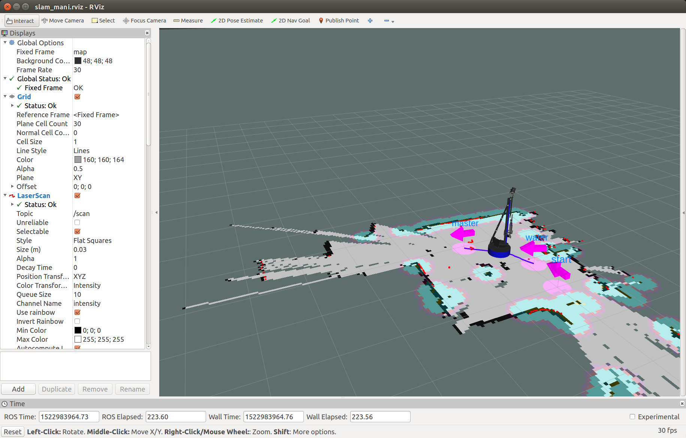
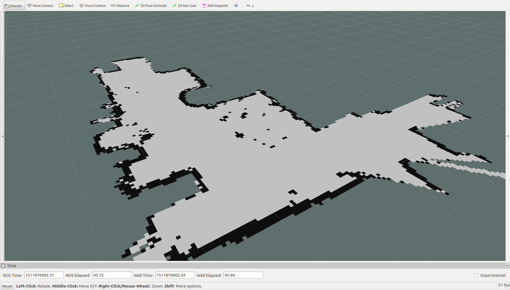
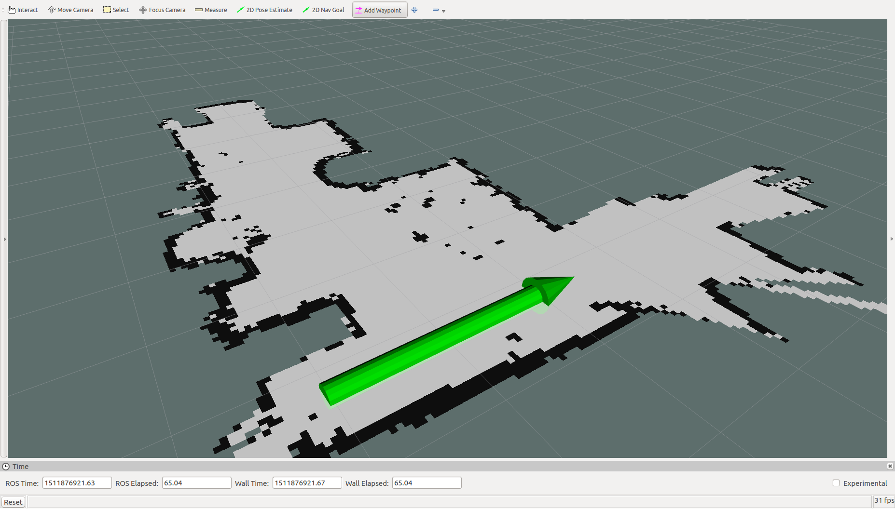
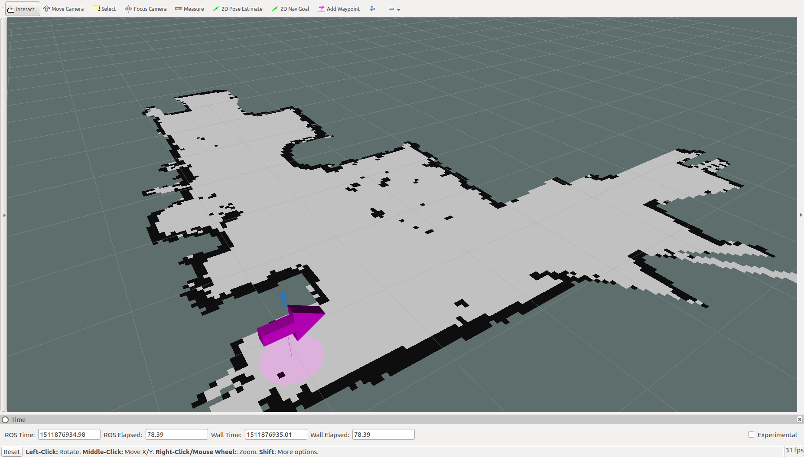
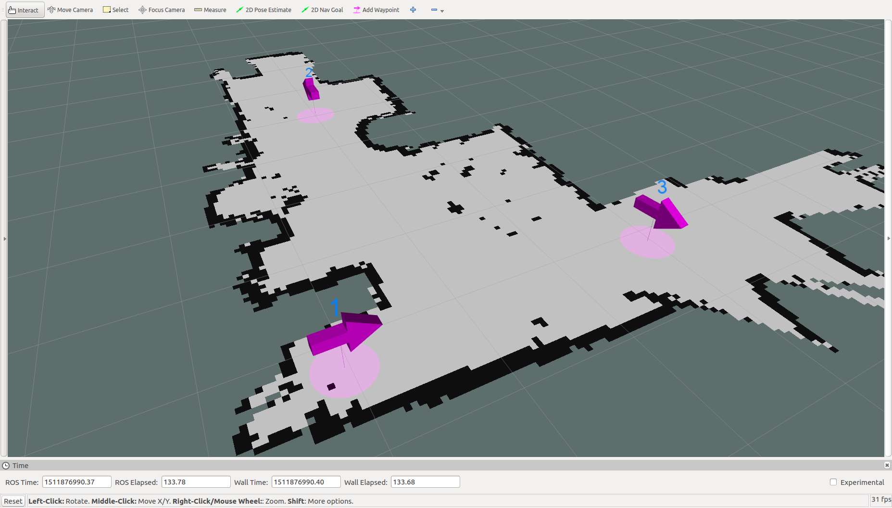

# MapTools工具

## 使用步骤

1. 安装ROS(kinetic/indigo)
2. 配置好开发环境. [配置方法](http://wiki.ros.org/ROS/Tutorials/InstallingandConfiguringROSEnvironment)
3. 安装依赖项:
```
sudo apt-get install ros-indigo-map-server
sudo apt-get install ros-indigo-navigation
```
```
sudo apt-get install ros-kinetic-map-server
sudo apt-get install ros-kinetic-navigation
```
4. 获取源码:
```
cd ~/catkin_ws/src/
git clone https://github.com/6-robot/waterplus_map_tools.git
```
5. 编译
```
cd ~/catkin_ws
catkin_make
```

## 平台介绍
MapTools工具是[北京六部工坊科技有限公司](http://www.6-robot.com)为旗下WP系列机器人快速设置地图航点所设计的辅助工具,具有操作简单,效果直观的优点。目前支持启智ROS,启程3,启程4和启明1等型号的机器人.


## 操作方法

### 1. 打开地图
对于启智ROS这类使用本地开发模式的机器人,使用如下指令打开地图:
```
roslaunch waterplus_map_tools wpb_home_nav_test.launch
```
对于启明1这类使用远程开发模式的机器人,在机载电脑端运行如下指令:
```
roslaunch waterplus_map_tools add_waypoint_app.launch
```
然后在开发机端运行如下指令打开地图(记得先将ROS_MASTER_URI指向机器人):
```
roslaunch waterplus_map_tools add_waypoint_monitor.launch
```


### 2. 设置航点
在Rviz工具栏点击"Add Waypoint"按钮可在地图上设置航点。





### 3. 保存航点
航点设置完毕后,使用如下指令保存航点:
```
rosrun waterplus_map_tools wp_saver
```

### 4. 航点遍历
航点设置完毕后,可以使用如下指令让机器人将设置的航点逐个遍历:
```
rosrun waterplus_map_tools wp_nav_test
```
