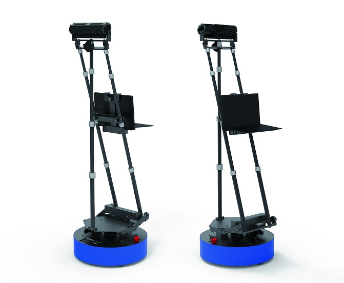
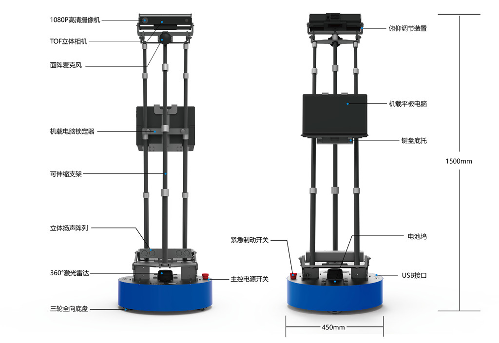
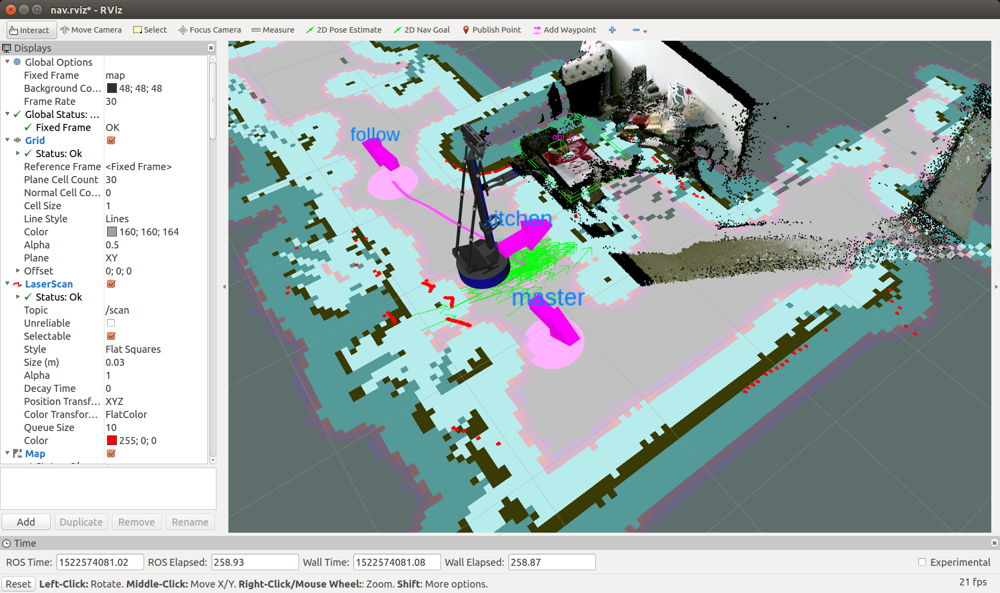

# 启智ROS机器人开放源码

## 源码介绍
本源码是[北京六部工坊科技有限公司](http://www.6-robot.com)出品的启智ROS机器人的综合例程合集。这些综合例程在启智ROS的标准例程基础上扩展出了语音识别,多航点间导航,移动抓取等复杂脚本,充分展示启智ROS的应用可能性,也给ROS开发者提供学习素材和应用框架。


## 硬件结构


## 应用示例


## 使用步骤

1. 安装ROS(indigo/Ubuntu 14.04). [安装步骤](http://wiki.ros.org/indigo/Installation/Ubuntu)
2. 配置好开发环境. [配置方法](http://wiki.ros.org/ROS/Tutorials/InstallingandConfiguringROSEnvironment)
3. 获取依赖源码包:
[Kinect2](https://github.com/code-iai/iai_kinect2)
[RPLidar](https://github.com/robopeak/rplidar_ros)
[启智ROS基础源码](https://github.com/6-robot/wpb_home)
[科大讯飞语音包](https://github.com/6-robot/xfyun_waterplus)
[六部工坊地图工具](https://github.com/6-robot/waterplus_map_tools)
4. 获取源码:
```
cd ~/catkin_ws/src/
git clone https://github.com/6-robot/wpb_home_apps.git
```
5. 编译
```
cd ~/catkin_ws
catkin_make
```
6. 欢迎享用 :)

