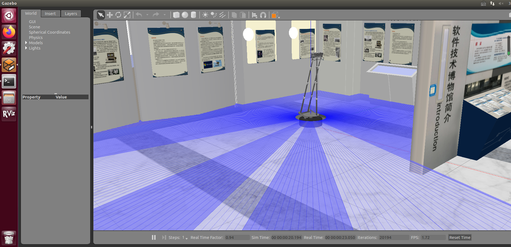
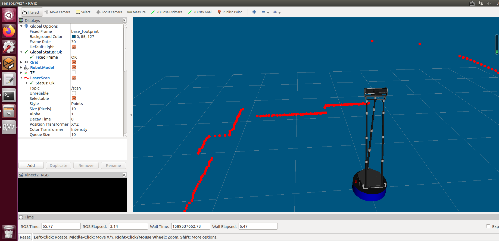

### 包说明

包wpb_sim与demo中xbot_sim包的作用一样，提供gazebo仿真需要的机器人模型、世界模型、配置文件，不过它的模型采用的是启智机器人，同时它还提供使用键盘控制机器人运动的node


### 文件说明

launch：
	wpb_rviz.launch：设置参数,打开rviz
	wpb_simple.launch：设置word和机器人模型，打开gazebo
src:
	keyboard_vel_ctrl.cpp：键盘控制机器人运动


### 步骤

1、打开一个cmd，到home目录下

```
$ mkdir -p demo2_ws/src 
```

2、将wpb_sim文件夹复制到src目录下
3、到demo2_ws目录

```
	$ rosdep install --from-paths src --ignore-src --rosdistro=kinetic -y
	$ catkin_make 
	$ source ./devel/setup.bash
	$ roslaunch wpb_sim wpb_simple.launch
```

4、打开另一个cmd，到demo2_ws目录

```
	$ source ./devel/setup.bash
	$ roslaunch wpb_sim wpb_rviz.launch
```

5、再打开另一个cmd，到demo2_ws目录

```
	$ source ./devel/setup.bash
	$ rosrun wpb_sim keyboard_vel_ctrl
```


### 结果


